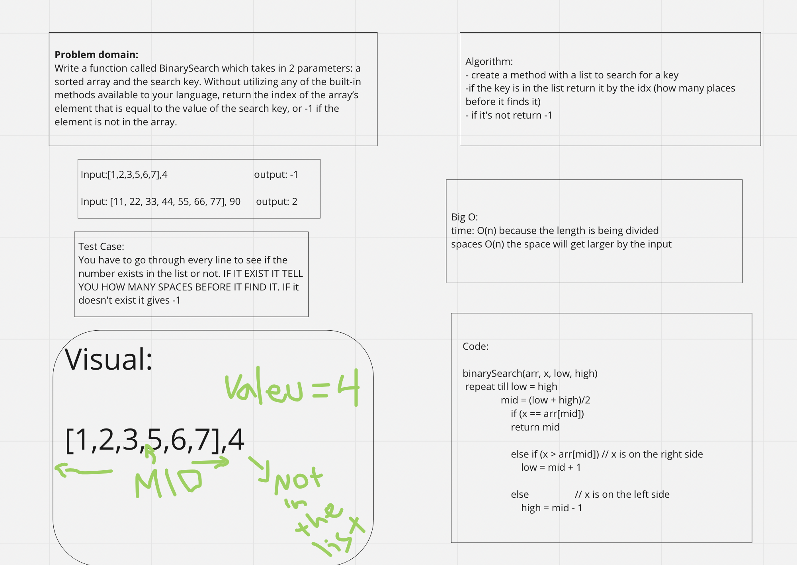

# array-binary-search
 Write a function called BinarySearch which takes in 2 parameters: a sorted array and the search key

## Whiteboard Process

## Approach & Efficiency
 I found information on binary code online so i copied that to complete my code. The Big O was O(n) and O(n) cause both were changing based on the input
it took me about 1 hour and a half to complete the assignment with some help
