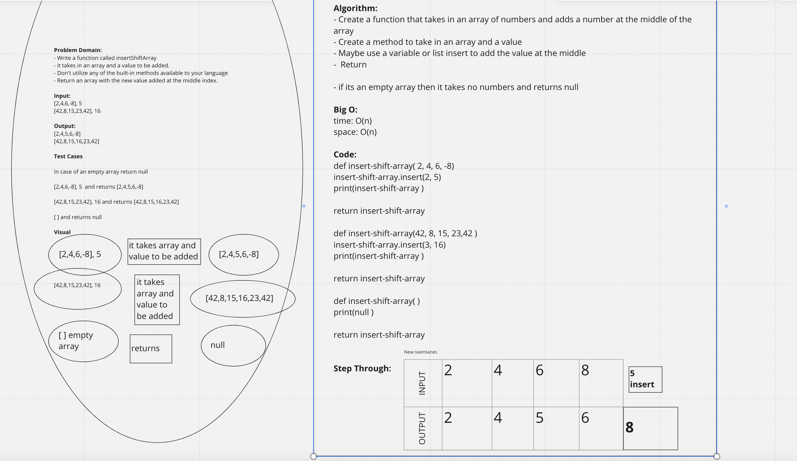

# Insert to Middle of an Array
<!-- create a whiteboard to add a value in the middle of an array-->

## Whiteboard Process

## Approach & Efficiency
<!-- What approach did you take? Discuss Why. What is the Big O space/time for this approach?
The Big O was O(n) and O(n) because both increase linearly in my approach.And I used insert in order to put the new value in the middle-->
