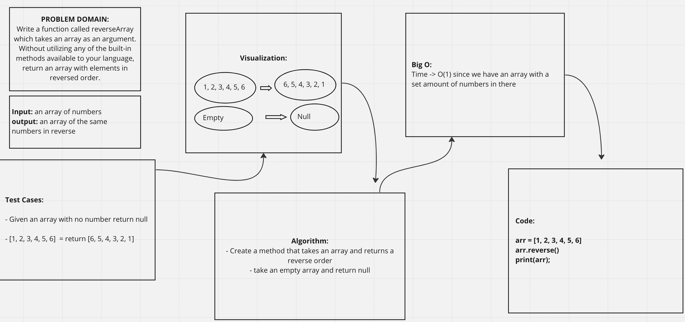

# Reverse an Array
Reverse Array

## Whiteboard Process

## Approach & Efficiency
The algorithm I created had a method that takes an array and returns a reverse order
or it takes an empty array and return null.
The Big O I made a mistake. It was O(n) cause everytime we add an item it will take more space and more time
to be completed
