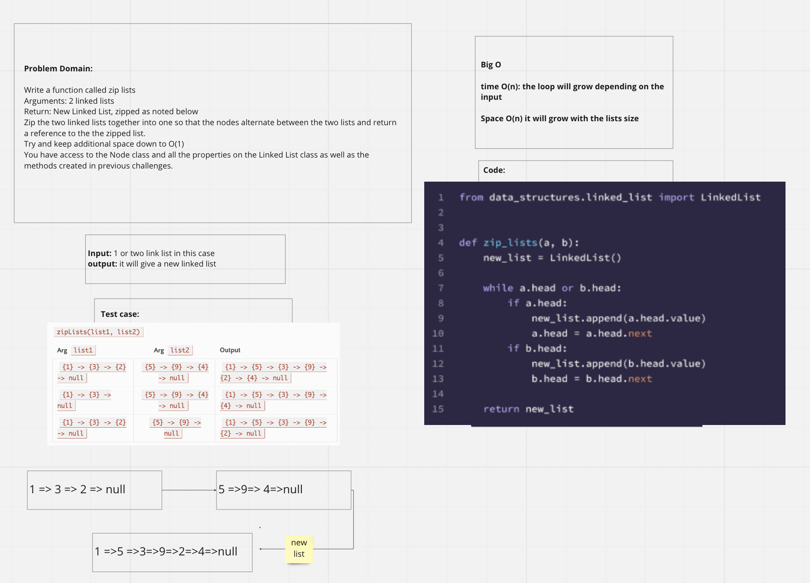

# linked-list-zip

## Challenge
Write a function called zip lists
Arguments: 2 linked lists
Return: New Linked List, zipped as noted below
Zip the two linked lists together into one so that the nodes alternate between the two lists and return a reference to the the zipped list.
Try and keep additional space down to O(1)
You have access to the Node class and all the properties on the Linked List class as well as the methods created in previous challenges.

## Approach & Efficiency
 What approach did you take? Why? What is the Big O space/time for this approach?
- Createa  “while” loop as long as one of the 2 heads for the 2 input linked lists have a value.
- Continue this “while” loop until both input linked lists have no value for their heads.
- Return the new linked list.

## Contributors
Ricardo, Jason, Aubrey

## Time it took to complete
1 hour and a half

## Whiteboard

