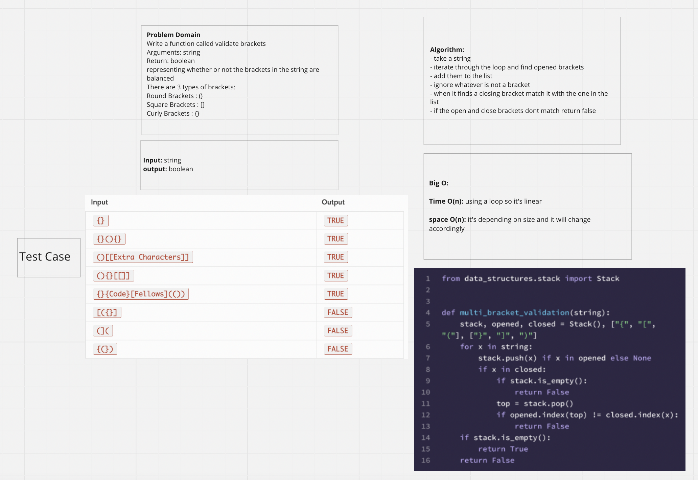

# stack-queue-brackets

Write a function called validate brackets
Arguments: string
Return: boolean
representing whether or not the brackets in the string are balanced
There are 3 types of brackets:

Round Brackets : ()
Square Brackets : []
Curly Brackets : {}

## Approach & Efficiency
- take a string
- iterate through the loop and find opened brackets
- add them to the list
- ignore whatever is not a bracket
- when it finds a closing bracket match it with the one in the list
- if the open and close brackets dont match return false

## WireFrame

## Big O

Time O(n): is linear because of the loop used
space O(n): cause it will grow based on the input

## Contributors
Ricardo, Jason, Aubrey.

## Time it took to complete
2 hour and a half.

