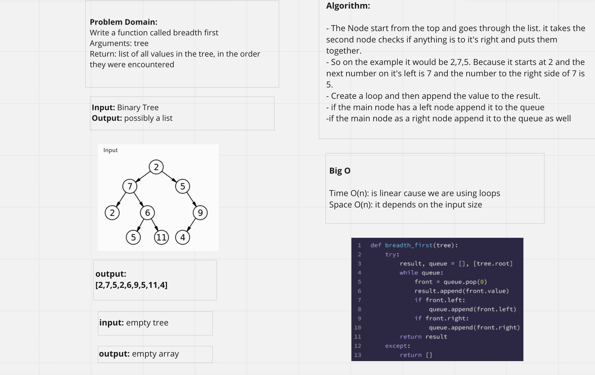

## Tree_Breadth_first

## Challenge Summary

Write a function called breadth first
Arguments: tree
Return: list of all values in the tree, in the order they were encountered

## Whiteboard Process

## Approach & Efficiency

Algorithm:

- The Node start from the top and goes through the list. it takes the second node checks if anything is to it's right and puts them together.
- So on the example it would be 2,7,5. Because it starts at 2 and the next number on it's left is 7 and the number to the right side of 7 is 5.
- Create a loop and then append the value to the result.
- if the main node has a left node append it to the queue
-if the main node as a right node append it to the queue as well#### Check if the tree is empty then If it is return none. If there are numbers though, look through the entire tree and find the highest value in the tree.

## Solution

#### pytest -k test_tree_breadth_first.py
