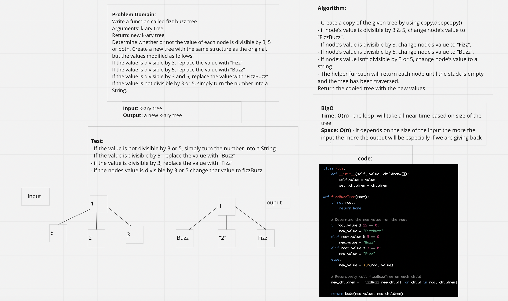

# Challenge Summary

* Feature Tasks
Write a function called fizz buzz tree
Arguments: k-ary tree
Return: new k-ary tree
Determine whether or not the value of each node is divisible by 3, 5 or both. Create a new tree with the same structure as the original, but the values modified as follows:

If the value is divisible by 3, replace the value with “Fizz”
If the value is divisible by 5, replace the value with “Buzz”
If the value is divisible by 3 and 5, replace the value with “FizzBuzz”
If the value is not divisible by 3 or 5, simply turn the number into a String.

## Whiteboard Process

## Approach & Efficiency

- Create a copy of the given tree by using copy.deepcopy()
- if node’s value is divisible by 3 & 5, change node’s value to “FizzBuzz”.
- If node’s value is divisible by 3, change node’s value to “Fizz”.
- If node’s value is divisible by 5, change node’s value to “Buzz”.
- If node’s value isn’t divisible by 3 or 5, change node’s value to a string.
- The helper function will return each node until the stack is empty and the tree has been traversed.

Efficiency
- Time: O(n) - the loop  will take a linear time based on size of the tree
- Space: O(n) - it depends on the size of the input the more the input the more the output will be especially if we are giving back

## Solution

The solution: `code_challenges/tree_fizz_buzz.py` file.

1. Within the virtual environment, install pytest via `pip install pytest`.
2. From the Python folder, run tests via `pytest tests/code_challenges/test_tree_fizz_buzz.py`.

## Contributors

- Ricardo
- Aubrey
- Jason
