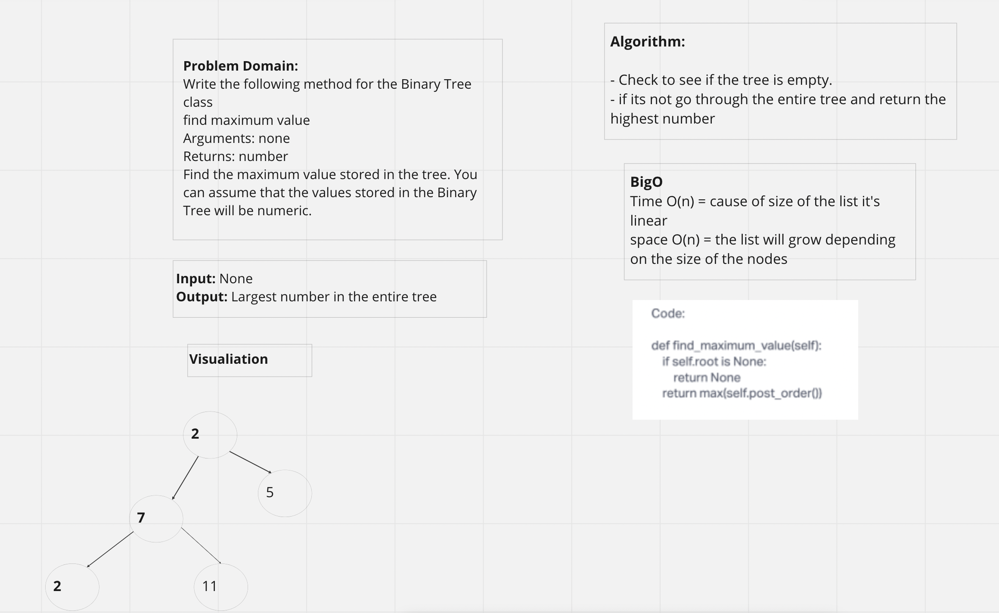

## Tree max

## Challenge Summary

#### Create a “find_maximum_value” method for the Binary Tree class. It should find the maximum value stored in the tree and return a number.

## Whiteboard Process

## Approach & Efficiency

#### Check if the tree is empty then If it is return none. If there are numbers though, look through the entire tree and find the highest value in the tree.

##Contributors

 #### Ricardo, Jason
 
## Solution

#### pytest -k test_tree_max.py
